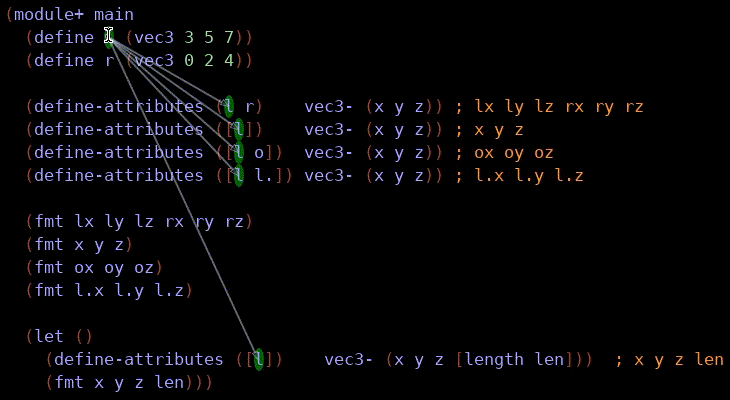

define-attributes
=================

This macro makes certain repetitive access patterns easier to write.
Its implementation was improved by feedback from the [racket community](https://racket.discourse.group/t/define-attributes-macro-is-this-useful-ideas-for-improvements/300?u=simonls).

[Documentation](https://docs.racket-lang.org/define-attributes/index.html)

_This animated gif shows the binding arrows in DrRacket for some example uses of the macro._

